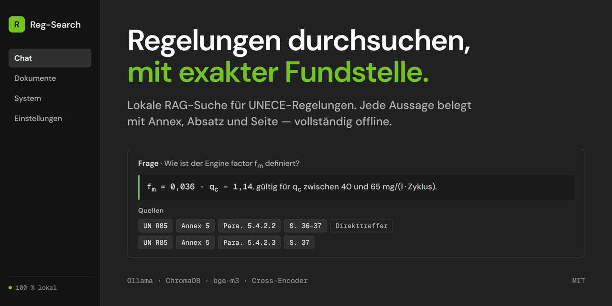

# 📘 Reg-Search

**Lokale RAG-Suche für UNECE-Regelungen** — 100 % offline, GPU-optimiert für 16 GB VRAM.
*Local RAG search for UNECE vehicle regulations — fully offline, optimised for a 16 GB GPU.*

[](https://www.python.org/)
[](LICENSE)




Reg-Search durchsucht UN/UNECE-Regelungen, GTRs und WP.29-Dokumente (PDF/DOCX)
semantisch und beantwortet Fragen **mit exakten Fundstellen** — Paragraph, Annex
und Seite. Kein Cloud-Dienst, keine API-Keys: Dokumente, Vektoren und LLM
bleiben auf der eigenen Maschine. Damit eignet sich das Tool auch für
vertrauliche Entwurfsstände und interne Normendokumente.

---

## Inhalt / Contents

- [Warum Reg-Search?](#warum-reg-search)
- [Architektur](#architektur)
- [Retrieval-Pipeline](#was-zwischen-frage-und-antwort-passiert)
- [Schnellstart](#-schnellstart--quick-start)
- [Bedienung](#bedienung)
- [Konfiguration](#konfiguration)
- [VRAM-Budget](#vram-budget-16-gb)
- [Reranker & Retrieval-Qualität](#reranker--retrieval-qualität)
- [Troubleshooting](#troubleshooting)
- [Projektstruktur](#projektstruktur)
- [Datenschutz](#datenschutz--privacy)
- [Beitragen](#beitragen--contributing)
- [Haftungsausschluss](#haftungsausschluss--disclaimer)
- [Lizenz](#lizenz--license)

---

## Warum Reg-Search?

| Problem                                                    | Lösung in Reg-Search                                                                 |
| ---------------------------------------------------------- | ------------------------------------------------------------------------------------ |
| Antworten ohne belastbare Fundstelle sind juristisch wertlos | **Structural Chunking**: Annex-/Paragraphen-Hierarchie wird erkannt und als Metadatum gespeichert |
| Reine Vektorsuche liefert thematisch ähnliche, aber falsche Absätze | **2-stufiges Retrieval**: Top-20 Vektorsuche → Cross-Encoder-Reranking auf Top-5      |
| Regelungen sind mehrsprachig (EN/DE/FR)                     | **BAAI/bge-m3** — mehrsprachiges Embedding-Modell, deutsche Frage findet englischen Absatz |
| Vertrauliche Dokumente dürfen die Firma nicht verlassen     | Alles lokal: Ollama + ChromaDB, keine ausgehenden Requests nach dem Modell-Download    |

---

## Architektur

```
                 ┌──────────────────────────────┐
   PDF / DOCX ──►│  document_processor.py        │
                 │  PyMuPDF · Struktur-Parser    │
                 │  → "Annex 3 / Para. 5.1.2"    │
                 └──────────────┬───────────────┘
                                │ Chunks + Metadaten
                                ▼
                 ┌──────────────────────────────┐
                 │  BAAI/bge-m3 (Embeddings)     │
                 └──────────────┬───────────────┘
                                ▼
                 ┌──────────────────────────────┐
                 │  ChromaDB (embedded)          │
                 │  ./chroma_db  ·  wie SQLite   │
                 └──────────────┬───────────────┘
   Frage ───────────────────────┤
                                ▼  ① Top-K = 20   (Recall)
                 ┌──────────────────────────────┐
                 │  BAAI/bge-reranker-large      │
                 └──────────────┬───────────────┘
                                ▼  ② Top-N = 5    (Precision)
                 ┌──────────────────────────────┐
                 │  Ollama · qwen2.5:14b         │
                 └──────────────┬───────────────┘
                                ▼
                    Antwort + zitierte Fundstellen
```

| Baustein         | Technologie                                        |
| ---------------- | -------------------------------------------------- |
| UI               | Streamlit                                          |
| Orchestrierung   | LangChain (`langchain-chroma`, `langchain-huggingface`) |
| LLM-Runtime      | Ollama (`qwen2.5:14b`, alternativ `llama3.1:8b`)   |
| Embeddings       | `BAAI/bge-m3` (multilingual, 1024 dim)             |
| Reranker         | `BAAI/bge-reranker-large` (Cross-Encoder)          |
| Vektorspeicher   | **ChromaDB, embedded** in `./chroma_db`            |
| PDF-Parsing      | PyMuPDF (`fitz`) + Tabellenextraktion              |

> **Warum ChromaDB?** Chroma läuft hier wie eine lokale SQLite-Datei: vollständig
> *embedded*, ohne Datenbankserver und ohne Docker. Vektoren **und** UNECE-Metadaten
> (Paragraph, Annex, Dateiname, Chunk-ID, Seitenbereich) liegen gemeinsam in
> `./chroma_db` und sind damit einfach zu sichern oder weiterzugeben — der Ordner
> ist die Datenbank.

### Was zwischen Frage und Antwort passiert

Der Weg ist etwas länger als „Vektorsuche und fertig". Jeder Schritt existiert,
weil ein konkreter Fehlerfall ihn nötig gemacht hat:

| Schritt | Was passiert | Warum |
| --- | --- | --- |
| **0 · Direkttreffer** | Nennt die Frage eine Fundstelle (`§5.2.3.3.3`, `Annex 5`), wird der Absatz **über die Metadaten** geholt und der Vektorsuche vorangestellt | Embeddings kodieren Bedeutung, keine Bezeichner: `5.2.3.3.3`, `5.2.3.3.6` und `5.2.3.2.3` liegen im Vektorraum praktisch aufeinander. Ohne diesen Schritt lag der richtige Absatz teils nicht einmal unter den Top-20 |
| **1 · Vektorsuche** | Top-K = 20 Kandidaten über `BAAI/bge-m3` | Recall: lieber zu viele Kandidaten als der richtige gar nicht dabei |
| **1b · Formularzeilen** | Leere Felder aus Mitteilungsblättern fliegen raus — aber nur, solange etwas anderes übrig bleibt | Eine Zeile „Trade name: .........." belegt nichts |
| **2 · Reranking** | Cross-Encoder sortiert auf Top-N = 5 | Präzision: nur diese fünf Passagen erreichen das LLM |
| **2b · Spreizungsprüfung** | Liegen alle Reranker-Scores gleichauf (< `REG_SEARCH_RERANK_MIN_SPREAD`), bleibt die Reihenfolge der Vektorsuche stehen und das Ergebnis gilt als **unsicher** | Trennt der Cross-Encoder nicht, ist seine Sortierung Rauschen. UI und Prompt weisen dann darauf hin, statt die Lücke zu füllen |
| **3 · Elternabschnitte** | Zu den Treffern werden die übergeordneten Abschnitte nachgeladen | In UNECE-Texten steht der Rahmen eine Ebene höher: `5.3.2` beschreibt die Messung, der Prüfaufbau steht in `5.3`. Der Cross-Encoder findet solche Abschnitte nie — sie enthalten die Frageworte nicht |

Ein Direkttreffer wird in der Oberfläche als solcher gekennzeichnet und
unterliegt nicht dem Relevanzschwellwert: eine ausdrücklich genannte Fundstelle
ist keine Schätzung.

---

## 🚀 Schnellstart / Quick Start

### 0. Voraussetzungen / Prerequisites

- Python **3.10+**
- NVIDIA-GPU mit **≥ 12 GB VRAM** (empfohlen 16 GB) — läuft zur Not auch auf CPU
- [Ollama](https://ollama.com/download) installiert
- Beim ersten Start: ~2,5 GB Modell-Download von HuggingFace (danach offline)

### 1. Repository & virtuelle Umgebung

```bash
git clone https://github.com/Haivan160001/regulation-search.git
cd regulation-search

python -m venv .venv
# Windows (PowerShell)
.venv\Scripts\Activate.ps1
# Linux / macOS
source .venv/bin/activate
```

### 2. PyTorch mit CUDA installieren (vor den übrigen Paketen!)

Der CUDA-Build muss zur **GPU-Architektur** passen — sonst meldet
`torch.cuda.is_available()` zwar `True`, aber jeder Kernel-Aufruf scheitert mit
*„no kernel image is available for execution on the device"*.

```bash
nvidia-smi --query-gpu=name,driver_version --format=csv   # welche Karte?
```

| GPU-Generation                        | Index-URL                                       |
| ------------------------------------- | ----------------------------------------------- |
| RTX 50xx (Blackwell, `sm_120`)        | `https://download.pytorch.org/whl/cu130` (min. `cu128`) |
| RTX 40xx / 30xx (Ada, Ampere)         | `https://download.pytorch.org/whl/cu126`         |
| ältere Karten                          | `https://download.pytorch.org/whl/cu124`         |

```bash
# Beispiel RTX 5060 Ti / 5070 / 5080 / 5090
pip install torch --index-url https://download.pytorch.org/whl/cu130
```

> ⚠️ **Falls bereits ein CPU-Torch installiert ist**, überspringt pip den
> Download kommentarlos („Requirement already satisfied"). Dann die Version
> explizit angeben, z. B. `pip install torch==2.13.0+cu130 --index-url …` —
> `2.13.0+cpu` und `2.13.0+cu130` sind für pip verschiedene Versionen.
> Ein installiertes `torchvision` sollte aus demselben Index kommen.

Kontrolle:

```bash
python -c "import torch; print(torch.cuda.is_available(), torch.cuda.get_device_name(0))"
```

<sub>CPU-only: `pip install torch` genügt. Übersicht:
<https://pytorch.org/get-started/locally/>.</sub>

### 3. Abhängigkeiten

```bash
pip install -r requirements.txt
```

### 4. LLM über Ollama laden

```bash
ollama serve            # falls der Dienst nicht ohnehin läuft
ollama pull qwen2.5:14b # Standardmodell (~9 GB)
# schlanke Alternative für kleinere GPUs:
ollama pull llama3.1:8b
```

### 5. Starten

```bash
streamlit run app.py
```

→ <http://localhost:8501> im Browser öffnen. Unter **Dokumente → Bibliothek**
eine UNECE-Regelung hochladen, **Indizieren** klicken, dann unter **Chat**
fragen. 🎉

<sub>Beim allerersten Start fragt Streamlit einmalig nach einer E-Mail-Adresse
(Newsletter) — einfach Enter drücken. In Skripten/CI stattdessen
`streamlit run app.py --server.headless true` verwenden.
Die App lauscht laut `.streamlit/config.toml` nur auf `localhost`; für Zugriff
aus dem LAN dort die Zeile `address` auskommentieren.</sub>

---

## Bedienung

Die Sidebar ist reine Navigation mit vier Bereichen; alles Weitere steckt in
Reitern innerhalb des jeweiligen Bereichs.

**Chat**

Über dem Verlauf eine schmale Zeile mit Modellauswahl, Quellenfilter und
*Verlauf leeren*. Zur Wahl stehen hier nur die in Ollama installierten
Modelle; nachgeladen wird unter *System > Status*. Antworten werden gestreamt; jede Antwort hat einen Abschnitt
*Quellen* mit dem exakten Zitat und Chips für `Annex`, `Para.`, Seite sowie
Vektor- und Reranker-Score.

**Dokumente**

- **Bibliothek** — Mehrfach-Upload (PDF/DOCX), Fortschritt pro Datei;
  inhaltsgleiche Dateien werden über einen SHA-1-Fingerprint automatisch
  übersprungen. Darunter die indizierten Dokumente mit erkannten Annexen und
  *Entfernen* je Datei
- **Vorschau** — PDF-Seitenvorschau, Dateimetadaten, erkannte Regelungsnummer
  und Indizierungsstatus

**System**

- **Status** — Ollama-Erreichbarkeit, installierte Modelle als Liste mit
  Papierkorb je Eintrag (Deinstallieren nach Rückfrage im Dialog),
  Modellauswahl (installierte Einträge blass) mit *Installieren* zum
  Nachladen per `ollama pull`, geladene Modelle, VRAM
- **Retrieval** — Top-K (Vektorsuche), Top-N (Reranker), Temperatur
- **Datenbank** — Anzahl Dokumente/Chunks, Speicherort, Collection leeren

**Einstellungen**

- **Sprache** — Oberfläche auf Deutsch oder Englisch. Die Wahl landet als
  `?lang=` in der URL und überlebt damit einen Reload; die Startsprache setzt
  `REG_SEARCH_LANG` (Standard `de`).
- **Über / Ablage** — Version, Pfade zu Uploads und Vektorindex

<sub>Die **Antwort**-Sprache ist davon unabhängig: `SYSTEM_PROMPT` weist das
Modell an, in der Sprache der jeweiligen Frage zu antworten. Eine englische
Frage wird also auch bei deutscher Oberfläche englisch beantwortet.</sub>

**Beispielfragen**

```text
Welche Anforderungen stellt die Regelung an das Cyber Security Management System?
Was muss der Antrag auf Genehmigung nach Absatz 3 enthalten?
Welche Prüfbedingungen sind in Annex 3 festgelegt?
Unterschied zwischen "shall" und "should" in Abschnitt 5?
```

---

## Konfiguration

Alle Parameter stehen in [`config.py`](config.py) und lassen sich per
Umgebungsvariable oder `.env` überschreiben (`cp .env.example .env`).

| Variable                        | Default                   | Bedeutung                                  |
| ------------------------------- | ------------------------- | ------------------------------------------ |
| `REG_SEARCH_LLM_MODEL`          | `qwen2.5:14b`             | Ollama-Modell                              |
| `REG_SEARCH_OLLAMA_URL`         | `http://localhost:11434`  | Ollama-Endpunkt                            |
| `REG_SEARCH_EMBEDDING_MODEL`    | `BAAI/bge-m3`             | Embedding-Modell                           |
| `REG_SEARCH_RERANKER_MODEL`     | `BAAI/bge-reranker-large` | Cross-Encoder                              |
| `REG_SEARCH_DEVICE`             | `auto`                    | `auto` / `cuda` / `cpu`                    |
| `REG_SEARCH_FP16`               | `1`                       | fp16 für die Encoder (halbiert VRAM)       |
| `REG_SEARCH_TOP_K` / `TOP_N`    | `20` / `5`                | Retrieval-Stufe 1 / 2                      |
| `REG_SEARCH_CHUNK_SIZE`         | `1200`                    | Chunk-Größe in Zeichen                     |
| `REG_SEARCH_NUM_CTX`            | `8192`                    | Kontextfenster des LLM                     |
| `REG_SEARCH_CHROMA_DIR`         | `./chroma_db`             | Speicherort der Vektordatenbank            |

---

## VRAM-Budget (16 GB)

| Komponente                                | fp16 / Q4 | Hinweis                              |
| ----------------------------------------- | --------- | ------------------------------------ |
| `qwen2.5:14b` (Q4_K_M, `num_ctx` 8192)    | ~9,0 GB   | über Ollama                          |
| `BAAI/bge-m3` (`max_seq_length` 1024)     | ~1,2 GB   | fp16 auf CUDA                        |
| `BAAI/bge-reranker-large` (`max_len` 512) | ~0,8 GB   | wird erst bei der ersten Suche geladen |
| **Summe**                                 | **~11 GB** | Rest bleibt für Aktivierungen/Desktop |

### Gemessene Performance

Referenzsystem: RTX 5060 Ti (16 GB), torch 2.13.0+cu130, `qwen2.5:14b`.

| Vorgang                                    | Zeit    |
| ------------------------------------------ | ------- |
| Erster Start (Modell-Download bge-m3 + Reranker) | einmalig ~1–2 min |
| Start mit warmem HF-Cache                  | ~10 s   |
| Indizierung                                | ~0,3 s je Chunk-Batch |
| Retrieval (Vektorsuche + Reranking)        | ~4 s (inkl. erstmaligem Laden des Rerankers) |
| Generierung                                | ~10 Token/s |
| VRAM im Betrieb                            | 6,7 / 15,9 GB |

**Weniger VRAM?**

```bash
# 8-GB-Karten
export REG_SEARCH_LLM_MODEL=llama3.1:8b
export REG_SEARCH_RERANKER_MODEL=BAAI/bge-reranker-base
# Encoder auf die CPU auslagern (langsamer, spart ~2 GB)
export REG_SEARCH_DEVICE=cpu
```

Reg-Search fängt CUDA-OOM zur Laufzeit ab, halbiert automatisch die Batchgröße
und gibt den Cache frei, statt mit einem Traceback abzustürzen.

---

## Reranker & Retrieval-Qualität

Die zweite Retrieval-Stufe entscheidet, welche fünf Passagen das LLM
überhaupt zu sehen bekommt. Dieser Abschnitt erklärt, welchen Reranker Sie für
Ihre Sprache wählen sollten und was an einer echten Regelung gemessen wurde.

### Reranker nach Sprache wählen / Choosing a reranker for your language

Das **Embedding-Modell bleibt für alle Sprachen gleich**: `BAAI/bge-m3` ist
mehrsprachig und findet mit einer deutschen Frage zuverlässig englische Absätze.
Sprachabhängig ist nur die zweite Stufe, der **Reranker**.

*The embedding model is language-agnostic — only the reranker choice depends on
your language.*

| Ihre Fragesprache / your query language | Empfehlung / recommendation | Grundlage / basis |
| --------------------------------------- | --------------------------- | ----------------- |
| **Deutsch** | `BAAI/bge-reranker-large` *(Default)* | gemessen: Top-5 100 %, bestes Ergebnis im Vergleich |
| **English** | `BAAI/bge-reranker-large`, alternativ `mixedbread-ai/mxbai-rerank-base-v2` ᵗ | gemessen: MRR 0.833 bzw. 0.886 |
| Deutsch **und** Englisch gemischt | `BAAI/bge-reranker-large` | in beiden Sprachen 100 % Top-5 |
| Französisch, Spanisch, Italienisch, Portugiesisch | `BAAI/bge-reranker-large` als Start, `BAAI/bge-reranker-v2-m3` gegentesten | **nicht gemessen** — beide Modelle nutzen einen mehrsprachigen XLM-R-Unterbau |
| Chinesisch / 中文 | `BAAI/bge-reranker-large` | Trainingsschwerpunkt des Modells liegt auf Englisch + Chinesisch |
| Japanisch, Koreanisch, Arabisch, slawische Sprachen | `BAAI/bge-reranker-v2-m3` | **nicht gemessen** — v2-m3 ist explizit auf Mehrsprachigkeit ausgelegt |
| GPU mit < 8 GB VRAM, jede Sprache | `BAAI/bge-reranker-base` | ~0,3 GB statt ~0,8 GB, dafür schwächer |

<sub>ᵗ benötigt `REG_SEARCH_TRUST_REMOTE_CODE=1` (führt Modellcode von
HuggingFace aus) und ggf. `pip install einops`.
Alle hier empfohlenen Modelle stehen unter MIT oder Apache-2.0 und sind
kommerziell nutzbar — anders als `jina-reranker-v2-base-multilingual`, das
weiter unten nur im Messvergleich auftaucht (CC-BY-NC-4.0, siehe
[Lizenzen der Abhängigkeiten](#lizenzen-der-abhängigkeiten)).</sub>

```bash
# Modell wechseln (keine Neuindizierung nötig - der Reranker berührt den Index nicht)
REG_SEARCH_RERANKER_MODEL=BAAI/bge-reranker-v2-m3
```

> **Wichtig:** Belastbar gemessen wurden nur **Deutsch und Englisch**, an *einer*
> Regelung (UN R85, 11 Fragen je Sprache). Alle übrigen Zeilen sind begründete
> Startwerte aus der Modellarchitektur, **keine Messergebnisse**. Wer in einer
> anderen Sprache arbeitet, misst mit einem eigenen Fragebogen nach:
>
> ```bash
> python tools/benchmark_reranker.py meine_fragen.json
> ```
>
> Pull Requests mit Messwerten für weitere Sprachen sind ausdrücklich
> willkommen — siehe [CONTRIBUTING.md](CONTRIBUTING.md).
>
> *Only German and English were measured. Other rows are reasoned starting
> points, not benchmark results — please measure your own language and send a PR.*

Bei der Auswahl zählt **Top-5, nicht MRR**: nur diese fünf Passagen erreichen
das LLM. Ein Modell mit leicht besserem MRR, aber schlechterem Top-5, liefert in
der Praxis mehr unbeantwortbare Fragen — genau deshalb bleibt hier
`bge-reranker-large` und nicht `bge-reranker-v2-m3` der Default.

### Retrieval-Qualität deutsch/englisch (gemessen an UN R85)

11 Fachfragen, jeweils deutsch und englisch, mit bekannter Soll-Fundstelle;
Kandidatenpool je Frage sind die Top-20 der Vektorsuche. MRR = mittlerer
Kehrwert des Rangs der korrekten Passage, Top-5 = Anteil Fragen mit korrekter
Passage unter den ersten fünf.

| Reranker | Lizenz | MRR de | Top-5 de | MRR en | Top-5 en | Spread de |
| --- | --- | --- | --- | --- | --- | --- |
| *ohne* (nur bge-m3-Vektorsuche) | – | 0.697 | 100 % | 0.742 | 91 % | – |
| **BAAI/bge-reranker-large** (Default) | MIT | 0.788 | **100 %** | 0.833 | 100 % | 0.30 |
| BAAI/bge-reranker-v2-m3 | Apache-2.0 | 0.798 | 82 % | 0.763 | 91 % | 0.29 |
| mixedbread-ai/mxbai-rerank-base-v2 ᵗ | Apache-2.0 | 0.754 | 91 % | **0.886** | 100 % | **0.84** |
| jinaai/jina-reranker-v2-base-multilingual ᵗ | **CC-BY-NC-4.0** ⁿᶜ | 0.702 | 91 % | 0.758 | 100 % | 0.50 |
| Alibaba-NLP/gte-multilingual-reranker-base ᵗ | Apache-2.0 | 0.562 | 82 % | 0.753 | 100 % | 0.32 |

> ⚠️ **ⁿᶜ Nicht für kommerzielle Nutzung.** `jina-reranker-v2-base-multilingual`
> steht unter **CC-BY-NC-4.0** und ist damit auf Forschung und Evaluation
> beschränkt; für den kommerziellen Einsatz verweist Jina AI auf seine
> kostenpflichtigen APIs. Die Zeile steht hier nur, weil das Modell mitgemessen
> wurde — **als Empfehlung für den Betrieb in einer Homologationsabteilung
> scheidet es aus.** Alle übrigen gemessenen Modelle sind MIT oder Apache-2.0
> und kommerziell nutzbar.
>
> *Not for commercial use — the Jina model is CC-BY-NC-4.0 and listed for
> comparison only.*

<sub>ᵗ benötigt `trust_remote_code=True` (führt Modellcode von HuggingFace aus);
`jina-reranker-v2` zusätzlich `pip install einops`.
Stichprobe: 11 Fragen × 2 Sprachen an *einer* Regelung — Unterschiede von
&lt; 0.05 MRR sind nicht aussagekräftig, Top-5-Differenzen entsprechen 1–2 Fragen.
Lizenzen am 31.08.2026 gegen die Modellkarten auf HuggingFace geprüft.</sub>

Ableitungen:

- Die zweite Stufe lohnt sich: der Reranker hebt MRR gegenüber reiner
  Vektorsuche deutlich (0.697 → 0.788 auf Deutsch).
- `bge-reranker-large` ist auch bei **deutschen** Fragen die beste der
  getesteten Optionen — trotz seines englisch/chinesischen Trainingsfokus.
  Ausdrücklich mehrsprachige Modelle waren hier *nicht* besser.
- Für überwiegend englische Nutzung ist `mxbai-rerank-base-v2` einen Test wert
  (bestes MRR en, deutlich trennschärfere Scores).
- Englische Fragen liegen etwas vorn (MRR 0.833 vs. 0.788). Wer die exakten
  Fachbegriffe der Regelung kennt, fragt am besten englisch; die Antwort kommt
  trotzdem in der Sprache der Frage.
- **Einzelne** Fragen brechen dennoch ein: bei „Welche Bezugskraftstoffe sind
  vorgeschrieben?" lagen alle 20 Kandidaten bei Score ~0.0002 — die Sortierung
  war reines Rauschen. Für genau diese Fälle prüft Reg-Search die Spreizung der
  Reranker-Scores (`REG_SEARCH_RERANK_MIN_SPREAD`): trennt der Cross-Encoder
  nicht, bleibt die Reihenfolge der Vektorsuche stehen und das Ergebnis wird als
  **geringe Trefferkonfidenz** markiert — mit Warnung in der UI und einer
  Prompt-Anweisung, die Wissenslücke offenzulegen statt sie zu füllen.

---

## Troubleshooting

| Symptom                                             | Ursache & Lösung                                                                                     |
| --------------------------------------------------- | ---------------------------------------------------------------------------------------------------- |
| *„Ollama ist nicht erreichbar"*                     | `ollama serve` starten; Port 11434 prüfen (`curl http://localhost:11434/api/tags`)                    |
| *„Modell ist nicht installiert"*                    | Unter *System > Status* das Modell wählen und *Installieren* klicken (oder `ollama pull qwen2.5:14b`)  |
| *„Aus … konnte kein Text extrahiert werden"*        | Gescanntes PDF ohne Textlayer → vorher OCR anwenden, z. B. `ocrmypdf in.pdf out.pdf`                  |
| CUDA out of memory                                  | LLM entladen (`ollama stop qwen2.5:14b`), kleineres Modell, oder `REG_SEARCH_DEVICE=cpu`              |
| Erster Start dauert lange                           | Einmaliger HuggingFace-Download (~2,5 GB); Ziel per `HF_HOME` umlenkbar                                |
| ChromaDB lässt sich nicht öffnen                    | Zweite laufende Instanz auf `./chroma_db` beenden                                                      |
| Antworten zitieren keine Paragraphen                | Dokument folgt nicht dem UNECE-Layout → Warnung beim Indizieren; Suche funktioniert, Zitate sind grober |
| Streamlit lädt endlos neu                           | `.streamlit/config.toml` setzt bereits `fileWatcherType = "none"` — Datei nicht löschen                 |

---

## Projektstruktur

```
.
├── app.py                  # Streamlit-UI: Navigation, Chat, Dokumente, System
├── ui.py                   # Erscheinungsbild: Design-Tokens, CSS, eigene Bauteile
├── i18n.py                 # Texte der Oberfläche auf Deutsch und Englisch
├── rag_engine.py           # ChromaDB-Client, 2-stufiges Retrieval, Ollama-Generierung
├── document_processor.py   # PDF/DOCX-Parsing + Structural Chunking (Annex/Paragraph)
├── config.py               # zentrale Konfiguration (env-überschreibbar)
├── requirements.txt
├── .env.example
├── .streamlit/config.toml  # Theme (Dark Mode, Lime), Serverbindung, Schriften
├── static/fonts/           # mitgelieferte Schriften, lokal ausgeliefert
│   └── OFL.txt                     # SIL Open Font License 1.1 (Pflichtbeilage)
├── tools/
│   ├── benchmark_reranker.py       # Reranker für die eigene Sprache messen
│   ├── check_i18n.py               # Übersetzungen auf Vollständigkeit prüfen
│   └── fetch_fonts.py              # Schriften nach static/fonts laden
├── tests/
│   ├── test_document_processor.py  # Struktur-Parser (ohne pytest lauffähig)
│   └── test_rag_engine.py          # Direkttreffer, Elternabschnitte, Kurztitel
├── data/uploads/           # hochgeladene Originaldokumente
└── chroma_db/              # persistenter Vektorindex (wird automatisch angelegt)
```

### Erscheinungsbild

Die Oberfläche ist ein Einstellungs-Dashboard im Dark Mode. Die Graustufen
liegen bewusst eng beieinander — getrennt wird über Rahmen, nicht über
Füllung:

| Rolle | Wert |
|---|---|
| Sidebar | `#131313` |
| Arbeitsfläche und Karten | `#212121` |
| Nav-Zeile aktiv | `#303030` |
| Rahmen (Karten, Trennlinien) | `#3C3C3C` |
| Rahmen (Eingaben) | `#595959` |
| Text / Text gedämpft | `#DCDCDC` / `#AFAFAF` |
| Akzent | `#72C616` |

Kennzeichnend sind die dunklere Sidebar vor hellerer Arbeitsfläche, Karten
ohne eigene Füllung (gleiche Farbe wie die Seite, nur ein Rahmen), die
Navigation als schlichte Zeilenliste und der kleine, zurückhaltende
Seitentitel mit den Reitern direkt darunter.

Zwei bewusste Setzungen: Genau **eine** Farbe im Layout, das Lime `#72C616`
für Primärbuttons, aktiven Reiter, Fokusrahmen und Fortschritt — alles Übrige
bleibt grau, damit ein Akzent auch etwas bedeutet. Und **eine** Schrift
(DM Sans); Geist Mono bleibt Code, Pfaden und Modellnamen vorbehalten, weil
ein Dateipfad in einer Proportionalschrift schlecht lesbar ist.

Aufgeteilt ist das so:

| Wo | Was |
|---|---|
| `.streamlit/config.toml` | Farben, Radien, Schriften, Statustöne — alles, was Streamlit über `[theme]` selbst kann |
| `ui.py` | Layout, Navigation, Reiter und eigene Bauteile (Badges, Zitate, Statuszeilen) |

Die Schriften liegen unter `static/fonts/` und werden von Streamlit selbst
ausgeliefert, nicht von Google Fonts nachgeladen — die App soll auch offline
und ohne Anfrage an Dritte funktionieren. Fehlen die Dateien, greifen die
Fallback-Stacks (Segoe UI / Consolas); neu laden mit:

```bash
python tools/fetch_fonts.py
```

### Tests

```bash
pytest tests/                             # beide Testdateien
python tests/test_document_processor.py   # Parser-Test auch ohne pytest lauffähig
```

`test_document_processor.py` baut ein synthetisches UNECE-PDF und prüft die
kritischen Fälle:
Annex-/Appendix-Erkennung, Querverweise im Fließtext (`… specified in Annex 1
to this Regulation;` darf **keine** Annex-Überschrift sein), Messwerte in
Umbruchzeilen (`23 ± 5 degrees C.` ist kein Paragraph „23") und die
ChromaDB-Kompatibilität der Metadaten.

### Structural Chunking — das Herzstück

Statt blind nach *n* Zeichen zu schneiden, erkennt der Parser die Hierarchie der
Regelung und hängt sie an jeden Chunk:

```python
{
  "regulation":  "UN Regulation No. 155",
  "annex":       "3",
  "paragraph":   "5.1.2",
  "section_path":"Annex 3 > Model of a communication > Para. 5.1.2",
  "citation":    "UN R155 · Annex 3 · Para. 5.1.2 · S. 27",
  "page_start":  27, "page_end": 27,
  "source":      "R155e.pdf", "doc_id": "9f2c…", "chunk_id": "9f2c…:00142"
}
```

Zusätzlich wird jedem einzubettenden Text ein kompakter Struktur-Header
(`[UN Regulation No. 155 | Annex 3 | Para. 5.1.2]`) vorangestellt — dadurch
bewerten Embedding-Modell *und* Reranker den regulatorischen Kontext mit, und die
UI kann die Fundstelle exakt ausweisen.

### Als Bibliothek nutzen

```python
from rag_engine import RegSearchEngine

engine = RegSearchEngine()
engine.index_file("data/uploads/R155e.pdf")

result = engine.answer("Welche Anforderungen gelten für das CSMS?")
print(result["answer"])
for chunk in result["sources"]:
    print(chunk.rank, chunk.citation, round(chunk.rerank_score, 2))
```

---

## Datenschutz / Privacy

Nach dem einmaligen Modell-Download läuft alles lokal: Dokumente werden in
`data/uploads/` gespeichert, Vektoren in `./chroma_db`, die Generierung erfolgt
über Ollama auf der eigenen GPU. Es werden keine Inhalte an Dritte gesendet;
die Telemetrie von ChromaDB ist deaktiviert.

## Beitragen / Contributing

Issues und Pull Requests sind willkommen — insbesondere weitere
Struktur-Parser (z. B. für EU-Verordnungen, FMVSS oder ISO-Normen),
Evaluationsdatensätze und UI-Verbesserungen.
Details, Coding-Konventionen und Architekturregeln stehen in
[CONTRIBUTING.md](CONTRIBUTING.md); für Fehler und Ideen gibt es
Issue-Vorlagen unter `.github/ISSUE_TEMPLATE/`.

## Haftungsausschluss / Disclaimer

Reg-Search ist ein Rechercheassistent und **keine Rechtsberatung**. Antworten
eines Sprachmodells können fehlerhaft sein — die zitierten Fundstellen sind
immer gegen die amtliche Fassung der Regelung zu prüfen.

## Lizenz / License

Der Code von Reg-Search steht unter der **MIT-Lizenz** — siehe
[LICENSE](LICENSE).

### Lizenzen der Abhängigkeiten

Reg-Search liefert keine dieser Komponenten mit; sie werden bei der
Installation von PyPI, HuggingFace bzw. Ollama bezogen und behalten ihre
eigene Lizenz. Wer Reg-Search weitergibt oder betreibt, sollte diese Liste
kennen:

| Komponente | Lizenz | Anmerkung |
| --- | --- | --- |
| **PyMuPDF** (`fitz`) | **AGPL-3.0** oder kommerziell (Artifex) | siehe Hinweis unten |
| Streamlit, ChromaDB, transformers, sentence-transformers | Apache-2.0 | |
| LangChain-Pakete, `ollama`-Client | MIT | |
| PyTorch, NumPy, python-docx | BSD / MIT | |
| `BAAI/bge-m3`, `BAAI/bge-reranker-large`, `BAAI/bge-reranker-base` | MIT | Modellgewichte (Default-Kette) |
| `BAAI/bge-reranker-v2-m3`, `mixedbread-ai/mxbai-rerank-base-v2`, `Alibaba-NLP/gte-multilingual-reranker-base` | Apache-2.0 | optionale Reranker, kommerziell nutzbar |
| `jinaai/jina-reranker-v2-base-multilingual` | **CC-BY-NC-4.0** | **nur Forschung/Evaluation** — nicht kommerziell nutzbar, nur im Messvergleich erwähnt |
| Qwen 2.5 (14B) | Apache-2.0 | Modellgewichte |
| Llama 3.1 | Meta Llama 3.1 Community License | Modellgewichte |
| DM Sans, Geist Mono | SIL OFL 1.1 | mitgeliefert, Lizenztext in [`static/fonts/OFL.txt`](static/fonts/OFL.txt) |

> **Hinweis zu PyMuPDF.** Das PDF-Parsing hängt an PyMuPDF, das unter
> **AGPL-3.0** steht (alternativ gibt es eine kommerzielle Lizenz von Artifex).
> Für die lokale Nutzung auf dem eigenen Rechner — der vorgesehene Fall — hat
> das keine Folgen. Wer Reg-Search dagegen **als Netzwerkdienst für andere
> betreibt**, unterliegt über PyMuPDF § 13 AGPL und muss den Nutzern den
> vollständigen Quelltext der betriebenen Fassung anbieten. Der MIT-lizenzierte
> Teil (dieses Repository) steht dem nicht im Weg — er ist mit der AGPL
> vereinbar —, aber die Pflicht besteht.
>
> *PDF parsing depends on PyMuPDF (AGPL-3.0). Local use is unaffected; hosting
> Reg-Search as a network service triggers AGPL § 13 for the combined work.*
